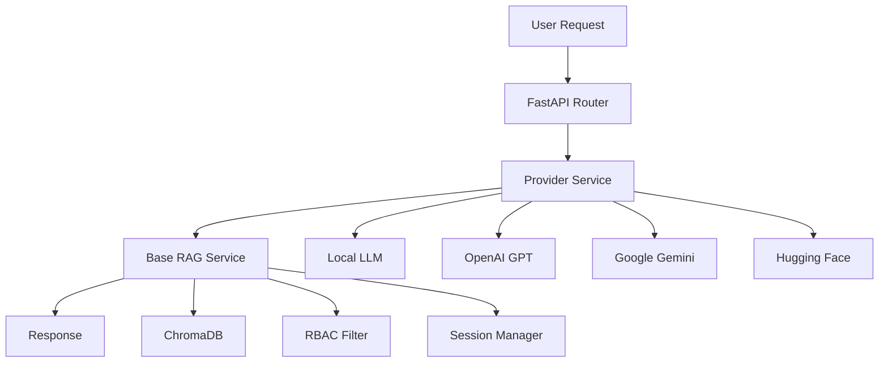

# 🚀 Multi-Provider Enterprise RAG System

[](https://python.org)
[](https://fastapi.tiangolo.com)
[](LICENSE)
[](CONTRIBUTING.md)

> **Enterprise-grade RAG system with multi-provider LLM support, advanced RBAC, and offline-first architecture**

A production-ready **Retrieval-Augmented Generation (RAG) system** that works with multiple LLM providers through a unified API. Supports both **offline operation** with local models and **cloud integration** with major AI providers.

## ✨ Key Features

- 🤖 **Multi-Provider Support** - Local models, OpenAI GPT, Google Gemini, Hugging Face
- 🔒 **Enterprise RBAC** - Role-based access control with flexible overrides
- 📚 **Document Versioning** - Non-destructive updates with full history
- 💬 **Session Management** - Persistent conversations with context
- 🚀 **Offline-First** - Works without internet using local LLMs
- ⚡ **Optimized Prompts** - Smart token budgeting and context truncation
- 🔍 **Debug Tools** - Complete prompt/response logging
- 🛡️ **Security** - JWT authentication with audit trails

## 🏗️ Architecture



### Supported Providers

| Provider | Models | Status |
|----------|--------|---------|
| **Local** | Mistral-7B, Phi-2, Llama-3.2, Gemma-2B | ✅ Offline |
| **OpenAI** | GPT-3.5, GPT-4 | ✅ API |
| **Google** | Gemini-2.5-Flash, Gemini-2.5-Pro | ✅ API |
| **Hugging Face** | Various models | ✅ API |

## 🚀 Quick Start

### Prerequisites
- Python 3.8+
- 8GB+ RAM (for local models)
- Git

### Installation

```bash
# Clone the repository
git clone https://github.com/your-username/ai_backend.git
cd ai_backend

# Install dependencies
pip install -r requirements.txt

# Set up environment variables (optional for cloud providers)
cp .env.example .env
# Edit .env with your API keys

# Start the server
python -m app.main
```

### First Query

```bash
# Test with local model (no API key needed)
curl -X POST "http://localhost:8000/api/rag/local/query" \
  -H "Content-Type: application/json" \
  -d '{"question": "What are the company policies?", "use_llm": true}'
```

## 📖 Use Cases

This system is perfect for:

- 🏢 **Enterprise Knowledge Management** - Centralized company information with role-based access
- 🎓 **Learning RAG Systems** - Complete implementation with multiple providers
- 🔬 **AI Research** - Experiment with different LLM providers and prompt strategies
- 🛠️ **Prototyping** - Quick setup for AI-powered applications
- 📚 **Document Q&A** - Intelligent search and retrieval from document collections

## 🔧 Configuration

### Environment Variables

```bash
# Optional: Cloud provider API keys
OPENAI_API_KEY=your_openai_key
GOOGLE_API_KEY=your_google_key
HUGGINGFACE_API_TOKEN=your_hf_token

# Server configuration
HOST=0.0.0.0
PORT=8000
DEBUG=false

# Model settings
DEFAULT_MODEL_NAME=mistral-7b-instruct-v0.2
EMBEDDING_MODEL_NAME=bge-small-en-v1.5
```

### Local Models

Place GGUF model files in the `models/` directory:

```
models/
├── mistral-7b-instruct-v0.2.Q3_K_M.gguf
├── phi-2-q4_k_m.gguf
├── llama-3.2-1b-instruct-q4_k_m.gguf
└── ...
```

Models are auto-detected and available via the API.

## 🔐 Security & RBAC

### Role Hierarchy

```
SuperAdmin (Level 4) ──┐
                       ├── Full system access
Manager (Level 3) ─────┤
                       ├── Department management
HR (Level 2) ──────────┤
                       ├── Employee data access
Employee (Level 1) ────┤
                       ├── Standard documents
Guest (Level 0) ───────┘
                       └── Public content only
```

### Document Security

- **Automatic Filtering**: Documents filtered by user role before LLM processing
- **Metadata-Based**: Each document chunk has sensitivity and access rules
- **Audit Logging**: All access attempts logged for compliance
- **Role Overrides**: Flexible `allowed_roles` bypass standard hierarchy

### Example Document Metadata

```json
{
  "sensitivity": "department_confidential",
  "department": "HR",
  "allowed_roles": ["SuperAdmin", "HR"],
  "owner_id": "user123"
}
```

---

## 📊 Performance & Monitoring

### Built-in Analytics

- **Token Usage Tracking** - Monitor prompt efficiency and costs
- **Response Time Metrics** - Track performance across providers
- **RBAC Audit Logs** - Security compliance and access monitoring
- **Debug Mode** - Complete prompt/response logging for optimization

### Optimization Features

- **Smart Context Truncation** - Automatic handling of long documents
- **Token Budgeting** - Dynamic allocation between system/context/query
- **Compressed Prompts** - Efficient system instructions (60-80 tokens)
- **Provider Fallbacks** - Automatic switching on failures

## 🔌 API Reference

### Query Endpoints

```http
POST /api/rag/{provider}/query
```

**Providers**: `local`, `google`, `gpt`, `huggingface`

**Request**:
```json
{
  "question": "What are the leave policies?",
  "top_k": 3,
  "use_llm": true,
  "max_tokens": 256
}
```

**Response**:
```json
{
  "answer": "Annual leave is 20 days per year...",
  "retrieved": [
    {
      "id": "doc_123",
      "text": "Leave policy document...",
      "metadata": {...},
      "distance": 0.85
    }
  ],
  "context": "Combined context from retrieved documents",
  "final_prompt": "System: You are an HR assistant..." // Debug mode
}
```

### Authentication

```http
POST /api/auth/token
```

```json
{
  "username": "employee1",
  "password": "password123"
}
```

### Document Management

```http
POST /api/rag/documents/add     # Add document
POST /api/rag/documents/seed    # Load sample data
GET  /api/rag/documents/list    # List documents
```

## 🛠️ Development

### Project Structure

```
ai_backend/
├── app/
│   ├── services/           # Core business logic
│   ├── api_routes_*.py     # API endpoints
│   ├── main.py            # FastAPI app
│   └── config.py          # Configuration
├── models/                # Local LLM files
├── data/                  # Sample documents
├── database/              # SQLite databases
└── requirements.txt       # Dependencies
```

### Adding New Providers

1. Create service class inheriting from `BaseRAGService`
2. Implement `generate_response()` method
3. Add route in `api_routes_rag.py`
4. Update provider list in documentation

### Running Tests

```bash
# Run optimization tests
python test_optimized_prompt.py

# Test specific provider
curl -X POST "http://localhost:8000/api/rag/local/query" \
  -H "Content-Type: application/json" \
  -d '{"question": "test", "use_llm": false}'
```

## 📚 Documentation

- **[API Documentation](http://localhost:8000/docs)** - Interactive Swagger UI
- **[Technical Context](APP_CONTEXT.md)** - Detailed system architecture
- **[Data Format Guide](data/README.md)** - Document structure and metadata
- **[Contributing Guide](CONTRIBUTING.md)** - Development guidelines

## 🤝 Contributing

We welcome contributions! Please see our [Contributing Guide](CONTRIBUTING.md) for details.

### Quick Contribution Steps

1. Fork the repository
2. Create a feature branch: `git checkout -b feature/amazing-feature`
3. Commit changes: `git commit -m 'Add amazing feature'`
4. Push to branch: `git push origin feature/amazing-feature`
5. Open a Pull Request

## 📄 License

This project is licensed under the MIT License - see the [LICENSE](LICENSE) file for details.

## 🙏 Acknowledgments

- **ChromaDB** - Vector database
- **FastAPI** - Web framework
- **Sentence Transformers** - Embedding models
- **llama-cpp-python** - Local LLM inference
- **OpenAI, Google, Hugging Face** - Cloud AI providers

## ⭐ Star History

[](https://star-history.com/#your-username/ai_backend&Date)

---

<div align="center">

**Built with ❤️ for the AI community**

[Report Bug](https://github.com/your-username/ai_backend/issues) • [Request Feature](https://github.com/your-username/ai_backend/issues) • [Discussions](https://github.com/your-username/ai_backend/discussions)

</div>


